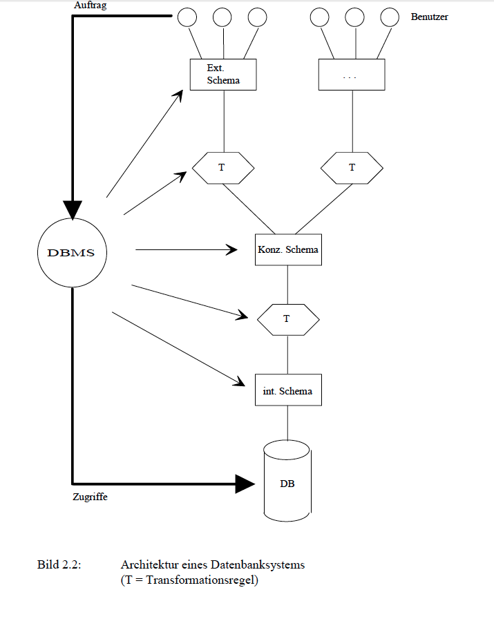
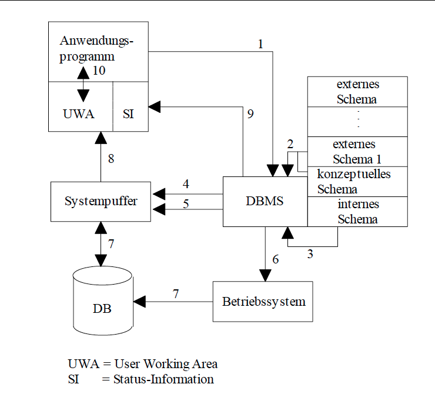

# DATENBANKEN 1

## 1. EINFÜHRUNG

### 1.1 DAS KONZEPT DES DATENBANKSYSTEMS

**Begriff der Datenbank:**

> Eine Datenbank ist eine integrierte Ansammlung von Daten, die allen Benutzern eines Anwendungsbereiches als gemeinesame Basis aktueller Information dient.

**DBMS:** *Datanbankmanagementsystem* 
> Das DBMS ist ein Softwaresystem, das es ermöglicht, eine Datenbank zu definieren, Daten zu speichern, zu verändern und zu löschen, sowie Anfragen an die Datenbank zu stellen. 

Ein DBMS isoliert die DB von den Anwendungsprogrammen, sodass der Programmierer die Details der Datenbank nicht kennen muss. 

### 1.2 Datenbanksysteme und traditionelle Datenverwaltung

**Dateisysteme** (file systems), als konventionelle Form der Verwaltung großer Datenmengen.

#### COBOL 

COBOL wurde in den 70er 80er entwickelt, und hat eine wichtige Rolle bei der Datenverarbeitung gespiert vor der Einführung von relationalen Datenbanken.

**Satz:** ist eine Gruppierung von **Datenelementen a.k.a. Felder**.

**Satztyp:** difiniert welche Datenelementen den Satz aufbauen. z.B.: 

````
Satztyp 		ANGESTELLTER
Datenelemente 	ANGNR 			Angestelltennummer
				NAME 			Name des Angestellten
				W-ORT 			Wohnort
				GEHALT 			Gehalt
				PERS 			Persönliche Daten;
								Zahl der Kinder usw
````

**Datei:** ist eine benannte Sammlung von Sätzen. 

**Dateisystem**

> Ein **Dateisystem** ist ein Softwarepaket, das den Zugriff auf einzelne Sätze in einer Datei besort, wenn das Anwendungsprogramm die entsprechenden Parameter liefert. 

**Schlüssel** werden benutzt um Datein aufzurufen.

**Dateiorganisation**
> Die Speicherung der Sätze einer Datei kann unterschiedlich organisiert werden, üblich sind: *sequentielle Organisation, index-sequentielle Organisationen, direkte Organisationen* (z. B. Hash-Verfahren).


````
FD 		ANGESTELLTEN-DATEI
		DATA RECORD IS ANGESTELLTER; ... .
01 		ANGESTELLTER; ... .
		02 ANGNR PIC 9(5);
		02 NAME PIC X(30);
		02 W-ORT PIC X(30);
		02 PERS; ... .
		02 GEHALT; ... .
````

Es herrscht also eine enge Kopplung zwischen Programm und Datei, dies führt zu schwierige probleme:

#### Probleme der traditionelle Datenverwaltung

1. **Redudanz**
> Da die Daten jeweils speziell für bestimmte Anwendungen entworfen werden, werden dieselben Daten in verschiedenen Dateien wieder auftauchen. Redundanz führt zu Speicherverschwendung und zu erhöhten Verarbeitungskosten, vor allem bei Änderungen. Schlimmer jedoch ist es, dass diese Redundanz in der Regel nicht zentral kontrolliert wird, so dass Konsistenzprobleme auftreten. 
2. **Inkonsistenz**
> Die Konsistenz der Daten (d.h. die logische Übereinstrimmung der Datei-Inhalte) kann nur schwer gewährleistet werden. Bei der Änderung einer Gröse müssten alle Dateien geändert werden, die diese Größe beinhalten. und diese verschiedene Programme zum selben Zeitpunkt unterschiedliche Werte derselben Größe sehen können.
3. **Daten-Programm-Abhängigkeit**
> Ändert sich der Aufbau einer Datei oder ihrer Organisationsform, so müssen darauf basierende Programme geändert werden. [...]
4. **Inflexibilität**
> Da die daten nicht in ihrer Gesamtheit, sondern nu anwendungsbezogen gesehen werden, ist es in vielen Fällen sehr kompliziert, neue Anwendungen oder Auswerungen vorhandener Daten zu realisieren. Dies gilt insbesondere für Auswertungen, die Daten aus verschiedenen Daeien benötigen würden. Die Organisation nach diesem konventionellen Vorgehen ist sehr wenig anpassungsfähig an die sich verändernden Anforderungen in einem Unternehmen. 

Um die probleme zu lösen wurden Daten als eingesdtändiges Betriebsmittel eines Unternehmens. Dazu ist auch die Trennung von Programm und Daten, **die Datenunabhängigkeit**, zentral. 

**Integrität der Daten:** Korrektheit und Vollständigkeit der abgespeicherten Daten. 

> Die zentrale Verwaltung der Daten durch das DBMS ermöglicht es, bei Änderung von Daten Kontrollroutinen einzuschalten oder von Zeit zu Zeit mit Hilfe spezieller Prüfprogramme nach Integritätsverlet-zungen zu suchen.


#### Vorteile der Datenbank-Philosophie:

1. Es gibt eine gemeinsame Basis für alle Anwendungen.

2. Redundanz entfällt.

3. Keine Konsistenzprobleme der traditioneller Dateiorganisationen. (wegen pt. 2)

4. Die Anwendungsprogrammierung wird einfacher. Der Programmierer muss nur die Eigenschaften der Daten kennen, nicht wie die gespeichert sind.

5. Application-Data abhängigkeit wird reduziert. 

6. DBS verschafft mehr flexilibität für diue Datenauswertung.

7. Daws DBS kann zentral die Korrektheir von Daten überprüfen. 

## 2. Architektur eines DBS

### 2.1 Drei Datenebenen

#### Logische Gesamtsicht

Die Beschreibung  der Gesamtheit der Daten des betrachteten Anwendungsbereiches. Alle Daten werden auf logischer Ebene in Form von Informationseinheiten und deren Beziehungen untereinander beschrieben.


#### Interne Sicht

Wie die Daten auf den Speichern organisiert werden. Muss für die Zugriffsanforderungen der verschiedenen Benutzer optimiert werden.

#### Externe Sichten

Verschiedene Darstellung der Daten für verschiedene Benutzergruppen.

-----

* Der Benutzer arbeitet Ausschließlich über die Externe Schicht. Das DBMS übernimmt die notwendigen Umsetzungen von einer *externen Schicht -> logische Gesamtsicht -> Interne Sicht*
* **Schema:** Jede Ebene Besitzt ein **Daten Model** was mit einer **Datenbescheibungsspache** beschrieben weird. Es gibt also:
 * Verschiedene externe Schemata
 * Ein konzeptuelles Schema
 * Internes Schema
 
 
 
### 2.2 Das konzeptuelle Modell

* Logische Gesamtsicht.
* Versucht die Realität abzubilden: alle Daten, und alle Beziehungen dieser Daten.
* **Integritätsbedingungen:** Beschreiben die Vorschriften zur Existenz dieser Daten, und zur Änderung dieser Daten. (Preconditions & Effects)
* Die Operationen die auf die Daten ausgeführt werden werden hier auch festgelegt.
> Bei den heute verbreiteten Relationen Datenbanksystemen gibt es diese Spezifikation von Operationen im konzeptuellen Schema der Datenbank nicht. Alle diese Systeme bieten sogenannte **generische Operationen** an, also Operationen, die auf alle Datentypen in der Datenbank anwendbar sind. Dies sind unter anderem speichern, lesen, löschen und modifizieren. Der Zugriff auf die Datenbank erfolgt mittels einer **Datenmanipulationssprache**, die diese Operationen zur Verfügung stellt.
*  **Objektorientierten Datenbanken**: jüngere Datenbanken wo Operationen als teil vom Schema festgelegt wurden.
* **Datenbescheibungsprache** *data definition language, DDL* ist für die Beschreibung des konzeptuelle Model geeignet.


> Beachten Sie den Unterschied zwischen den Begriffen „Datenbanksystem“ und „Informationssystem“. Leider werden beide Begriffe oft synonym verwendet. Das Informationssystem eines Unternehmens ist die Gesamtheit aller Instanzen und Prozesse, die die für das Unternehmen wichtige Information von außen aufnehmen, verarbeiten und entsprechende Information nach außen wieder abgeben. Das Datenbanksystem ist damit nur ein Teil des Informationssystems, nämlich derjenige Teil, in dem die Informationsbasis des Unternehmens verwaltet wird.

#### Vorteile des Konzeptuellen Modells:

1. Bietet einen stabilen Bezugspunkt für alle Anwendungen dar.
2. Stellt eine einheitliche Dokumentation wesentlicher Aspekte des Unternehmens dar.
3. Gebrauch der Daten kann zentral kontrolliert werden.
4. Schafft die wesentliche Vorraussetzungen für Datenunabhängigkeit der Anwendungsprogramme.

### 2.3 Das interne Modell

* Der Datenbankadministrator muss eine *physische Datenorganisation* entwickeln. 
* Folgende Punkte müssen betrachtet werden bei dem Entwurf
 * Repräsentation von Attributwerten.
 * Aufbau gespeicherter Sätze.
 * Zugriffsmethoden auf Sätze.
 * zusätzliche Zugriffspfade(Indexe, Verkettung, usw.)
 
### 2.4 Externe Modelle

* Verschiedene Benutzergruppen bekommen ihre eigene **View**.
* Benutzer müssen eine Sprache bekommen um die Daten zu benutzen, z.B. SQL, oder eine GUI

### 2.5 Das DBMS

Wenn ein Anwendungsprogramm Daten von von DBMS verlangt:

> 1. Das DBMS empfängt den Befehl des Anwendungsprogrammes, ein bestimmtes Objekt eines externen Modells zu lesen.
> 2. Das DBMS holt sich die benötigten Definitionen des entsprechenden Objekt-typs aus dem zugehörigen externen Schema.
> 3. Mit Hilfe der Transformationsregeln externes/konzeptuelles Schema stellt das DBMS fest, welche konzeptuellen Objekte und Beziehungen benötigt wer-den.
> 4. Mit Hilfe der Transformationsregeln konzeptuelles/internes Schema stellt das DBMS fest, welche physischen Objekte zu lesen sind, es ermittelt die auszu-nützenden Zugriffspfade.
> 5. Das DBMS übergibt dem Betriebssystem die Nummern der zu lesenden Spei-cherblöcke.
> 6. Das Betriebssystem übergibt die verlangten Blöcke an das DBMS in einem Systempuffer.
> 7. Mit Hilfe der Transformationsregeln stellt das DBMS aus den vorhandenen physischen Sätzen das verlangte externe Objekt zusammen.
> 8. Das DBMS übergibt das externe Objekt dem Anwendungsprogramm in sei-nen Arbeitsspeicher.
> 9. Das Anwendungsprogramm verarbeitet die vom DBMS übergebenen Daten.
 
Alternativ kann aus das **Binden** benutzt werden: 
>Um den Befehl eines Anwendungs-programms auszuführen, müssen die Objekte des externen Modells ausgedrückt werden durch Objekte des konzeptuellen Modells und schließlich durch Objekte des internen Modells. Sobald der Befehl, der sich auf ein externes Objekt bezieht, ersetzt ist durch Befehle, die sich auf das konzeptuelle Modell beziehen, sind die entsprechenden Daten des Anwendungsprogrammes an das konzeptuelle Modell „gebunden“, entsprechend für das interne Modell

Der **Bindezeitpunkt** kenn entweder zur *Übersetzungszeit* (compilation) oder zur *Laufzeit* (Interpretation) stattfinden.



Für ein SQL befehlt wie 

````
SELECT ANGNR, NAME, GEHALT
FROM   ANG
WHERE  ANGNR = 12
````
geht die Abarbeitung wie folgt vor:

1. Der DML-Befehlt wird an das DBMS übergeben.
2. Befehlt wird interpretiert, zugehörige konzeptionelle Beschreibung werden ermittelt. 
3. Speicherstruktur wird ermittelt (internes Schema), die Abfrage wird optimiert.
4. Das DBMS ermittelt die Datenseite auf der der gesuchte Satz gespeichert ist. Es prüft ob die Seite im Systempuffer gespeichert ist. If yes, then continue from 8.
5. Auswahl einer Seite im Systempuffer, die durch die benötigte Seite überlagert werden kann. Falls die zu ersetzende Seite verändert wurde, muss sie in die Datenbank geschrieben werden.
6. Das DBMS ruft das Betriebssystem für zwei E/A-Vorgänge auf:
 * Schreiben der zu ersetzenden Seite in die Datenbank (entfällt gegebenen-falls)
 * Einlesen der gesuchten Seite.
7. Das Betriebssystem führt die physischen E/A-Aufträge durch und speichert die angeforderte Seite an der vorgegebenen Adresse im Systempuffer.
8. Das DBMS liest den gesuchten Satz aus dem Systempuffer, transformiert ihn in die durch das externe Schema definierte Form und überträgt ihn in den Ar-beitsbereich (user work area - UWA) des Anwendungsprogrammes. In der UWA ist ein Speicherbereich für diesen Satztyp reserviert.
9. Das DBMS hinterlegt Status-Information über den Ausgang der Operation in einem speziellen Bereich der UWA. Diese Status-Information ist dem An-wendungsprogramm zugänglich.
10. Das Anwendungsprogramm verarbeitet den Satz. (Wir betrachten hier nicht die Abläufe auf der Sprachebene, wenn - wie in diesem Beispiel angedeutet - SQL in ein Programm in einer klassischen Programmiersprache eingebettet ist; s. unter relationale Datenbanken).

#### Weitere Aufgaben des DBMS
##### Datendefinition

* Das DBMS muss Datendefinitionen in den zugehörigen DDLs akzeptieren und interpretieren können. Dazu gehört:
  * externe Schemata
  * das konzeptuelle Schema,
  * das interne Schema
  * die zugehörigen Transformationsregeln
  * Meta-Daten. z.B:
    * Objekttypen
    * Attribute
* Die Daten werden im **Katalog** a.k.a. **Data Dictionary** des DBMS gespeichert.

##### Integrität der DAtenbank

* Das DBMS soll soweit wie möglich Integritätsverletzungen verhindern. 

##### Datensicherung (Recovery)

* Fehlern: Abbrüche von Anwendungsprogrammen, Systemzusammenbruch, Plattenfehler, etc.
* Das DBMS muss in der Lage sein die Datenbank nach Fehlern wieder in einen konsistenten Zustand zu versetzen.

##### Koordination gleichzeitig auf der Datenbank arbeitender Benutzer

* Das DBMS muss dafür Sorgen das die parallel arbeitenden Programme nicht gegenseitig stören oder infolge unkoordinierter Parallelarbeit die Integrität der Datenbank zerstören.

##### Schutz der Daten gegen unberechtigten Zugriff

* Hierzu gehören alle technischen Maßnahmen zum Datenschutz, d.h. zum Schutz der Daten gegen Missbrauch jeglicher Art.


### 2.6 Weitere Komponenten eines Datenbanksystems

#### Tools

Typische Tools sind

* Abfragesysteme
* Report-Writer
* Spreadsheets und Business Graphics Tools
* Tools für den Datenbankentwurf
* 4GL Entwicklungsumgebungen. 4GL (fourth generation language, Da-tenbanksprachen der vierten Generation) integrieren imperative Sprach-konzepte mit SQL. Sie unterstützen typischerweise die interaktive Pro-grammierung von Menüs, Masken und Formularen mit dahinterliegenden Prozeduren (Auslöseregeln und Aktionen).
* CASE Tools (computer aided software engineering) für den Entwurf von Datenbankanwendungen

#### Utilities

* „nützliche Sachen“
* Hilfsprogramme für den Datenbankadministra-tor.
* Typische Utilities sind:
  * Laderoutinen (für das erstmalige Laden der Datenbank)
  * statistische Routinen
  * Routinen zur Fehleranalyse
  * Routinen zur Reorganisation (der Daten auf den Speichern)
  * Kopier- und Archivierungsroutinen


#### Data Dictionary und Repository

**Funktionen:**

1. Es dient dem DBMS zur Speicherung der Daten zur Verwaltung der Datenbank (Schema-Informationen, Sichten, Zugriffsrechte, Informationen zur Optimierung von Anfragen wie etwa Statistiken usw.).
2. Es dient dem Anwendungsprogrammierer zur Suche nach Informationen über gespeicherte Daten und deren Struktur (Schema-Informationen) sowie zur Analyse bei Leistungsproblemen.

* Data Dictionary ist eine Datenbank.
* Data Dictionaries wachsen heutzutage zu **Repositories** wo alle wesentliche Informationen über die Daten, Programme und Benutzer des Informationssystems gespeichert werden.
* Ein modernes Data Dictionary System wird etwa folgende Informationen verwalten:
  * Beschreibungen der Daten
  * Angaben zu den Beziehungen zwischen den Daten
  * Beschreibungen der Programme (Transaktionen)
  * Angaben darüber, welche Programme welche Daten nutzen
  * Konsistenzbedingungen
  * Angaben über Zugriffsbefugnisse
  * Entwurfsdaten (grafische konzeptuelle Modelle, Dokumentation der Entwurfsschritte usw.)
  * Verantwortlichkeiten
  * Entwurfsdokumente, Quell-Code zu Anwendungsprogrammen

### 2.7 Datenunabhängigkeit

* Die dreischichtige Betrachtungsweise der Daten ist der Schlüssel zur Datenunabhängigkeit.
* Änderungen innerhalb einer Ebene können in gewissem Umfang von den übrigen Ebenen ferngehalten werden, indem man die Änderun-gen durch die zwischengelagerten Transformationsregeln auffängt.
> **Physische Datenunabhängigkeit** bedeutet Isolierung der Anwendungsprogramme von Änderungen der physischen Datenorganisation.
* Da das konzeptuelle Modell unberührt bleibt, bleiben auch die externen Modelle und damit alle Benutzerprogramme von Änderungen der Datenorganisation unberührt. So führen also Änderungen von *Dateiorganisationen*, das *Umstrukturieren von Sätzen* (z. B. Zerlegen von großen Sätzen in separate Teilsätze), das *Anlegen von Indexen*, usw. nicht mehr zu Änderungen bestehender Programme.
> **Logische Datenunabhängigkeit** bedeutet Isolierung der Anwendungsprogramme von Änderungen des konzeptuellen Modells.
* Praktisch alle Systeme weisen jedoch noch kleinere oder größere Schwächen in diesem Punkte auf.
> Der Begriff der Datenunabhängigkeit muss auch unter dem Gesichtspunkt des Bindens gesehen werden. Im Falle des Bindens zur Übersetzungszeit bleibt das Anwendungsprogramm nach Änderungen des internen oder konzeptuellen Schemas unverändert, muss aber neu übersetzt werden. Man spricht von **statischer Datenunabhängigkeit**. Im Falle des Bindens zur Zugriffszeit ist auch diese Abhängigkeit aufgehoben, man spricht von **dynamischer Datenunabhängigkeit**.

