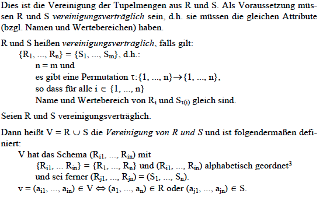
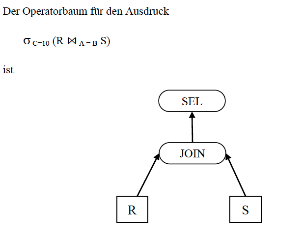
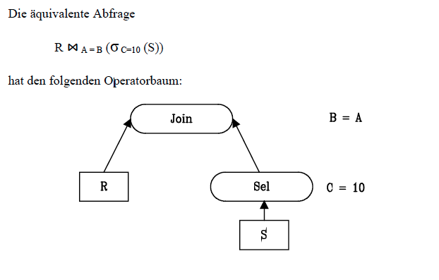

# DATENBANKEN 1

## 1. EINFÜHRUNG

### 1.1 DAS KONZEPT DES DATENBANKSYSTEMS

**Begriff der Datenbank:**

> Eine Datenbank ist eine integrierte Ansammlung von Daten, die allen Benutzern eines Anwendungsbereiches als gemeinsame Basis aktueller Information dient.

**DBMS:** *Datanbankmanagementsystem* 
> Das DBMS ist ein Softwaresystem, das es ermöglicht, eine Datenbank zu definieren, Daten zu speichern, zu verändern und zu löschen, sowie Anfragen an die Datenbank zu stellen. 

Ein DBMS isoliert die DB von den Anwendungsprogrammen, sodass der Programmierer die Details der Datenbank nicht kennen muss. 

### 1.2 Datenbanksysteme und traditionelle Datenverwaltung

**Dateisysteme** (file systems), als konventionelle Form der Verwaltung großer Datenmengen.

#### COBOL 

COBOL wurde in den 70er 80er entwickelt, und hat eine wichtige Rolle bei der Datenverarbeitung gespielt vor der Einführung von Relationen Datenbanken.

**Satz:** ist eine Gruppierung von **Datenelementen a.k.a. Felder**.

**Satztyp:** definiert welche Datenelementen den Satz aufbauen. z.B.: 

````
Satztyp 		ANGESTELLTER
Datenelemente 	ANGNR 			Angestelltennummer
				NAME 			Name des Angestellten
				W-ORT 			Wohnort
				GEHALT 			Gehalt
				PERS 			Persönliche Daten;
								Zahl der Kinder usw
````

**Datei:** ist eine benannte Sammlung von Sätzen. 

**Dateisystem**

> Ein **Dateisystem** ist ein Softwarepaket, das den Zugriff auf einzelne Sätze in einer Datei besorgt, wenn das Anwendungsprogramm die entsprechenden Parameter liefert. 

**Schlüssel** werden benutzt um Dateien aufzurufen.

**Dateiorganisation**
> Die Speicherung der Sätze einer Datei kann unterschiedlich organisiert werden, üblich sind: *sequentielle Organisation, index-sequentielle Organisationen, direkte Organisationen* (z. B. Hash-Verfahren).


````
FD 		ANGESTELLTEN-DATEI
		DATA RECORD IS ANGESTELLTER; ... .
01 		ANGESTELLTER; ... .
		02 ANGNR PIC 9(5);
		02 NAME PIC X(30);
		02 W-ORT PIC X(30);
		02 PERS; ... .
		02 GEHALT; ... .
````

Es herrscht also eine enge Kopplung zwischen Programm und Datei, dies führt zu schwierige Probleme:

#### Probleme der traditionelle Datenverwaltung

1. **Redundanz**
> Da die Daten jeweils speziell für bestimmte Anwendungen entworfen werden, werden dieselben Daten in verschiedenen Dateien wieder auftauchen. Redundanz führt zu Speicherverschwendung und zu erhöhten Verarbeitungskosten, vor allem bei Änderungen. Schlimmer jedoch ist es, dass diese Redundanz in der Regel nicht zentral kontrolliert wird, so dass Konsistenzprobleme auftreten. 
2. **Inkonsistenz**
> Die Konsistenz der Daten (d.h. die logische Übereinstimmung der Datei-Inhalte) kann nur schwer gewährleistet werden. Bei der Änderung einer Größe müssten alle Dateien geändert werden, die diese Größe beinhalten. und diese verschiedene Programme zum selben Zeitpunkt unterschiedliche Werte derselben Größe sehen können.
3. **Daten-Programm-Abhängigkeit**
> Ändert sich der Aufbau einer Datei oder ihrer Organisationsform, so müssen darauf basierende Programme geändert werden. [...]
4. **Inflexibilität**
> Da die Daten nicht in ihrer Gesamtheit, sondern nu anwendungsbezogen gesehen werden, ist es in vielen Fällen sehr kompliziert, neue Anwendungen oder Auswerungen vorhandener Daten zu realisieren. Dies gilt insbesondere für Auswertungen, die Daten aus verschiedenen Dateien benötigen würden. Die Organisation nach diesem konventionellen Vorgehen ist sehr wenig anpassungsfähig an die sich verändernden Anforderungen in einem Unternehmen. 

Um die Probleme zu lösen wurden Daten als eingensdtändiges Betriebsmittel eines Unternehmens. Dazu ist auch die Trennung von Programm und Daten, **die Datenunabhängigkeit**, zentral. 

**Integrität der Daten:** Korrektheit und Vollständigkeit der abgesicherten Daten. 

> Die zentrale Verwaltung der Daten durch das DBMS ermöglicht es, bei Änderung von Daten Kontrollroutinen einzuschalten oder von Zeit zu Zeit mit Hilfe spezieller Prüfprogramme nach Integritätsverletzungen zu suchen.


#### Vorteile der Datenbank-Philosophie:

1. Es gibt eine gemeinsame Basis für alle Anwendungen.

2. Redundanz entfällt.

3. Keine Konsistenzprobleme der traditioneller Dateiorganisationen. (wegen pt. 2)

4. Die Anwendungsprogrammierung wird einfacher. Der Programmierer muss nur die Eigenschaften der Daten kennen, nicht wie die gespeichert sind.

5. Application-Data Abhängigkeit wird reduziert. 

6. DBS verschafft mehr Flexibilität für die Datenauswertung.

7. Das DBS kann zentral die Korrektheit von Daten überprüfen. 

## 2. Architektur eines DBS

### 2.1 Drei Datenebenen

#### Logische Gesamtsicht

Die Beschreibung  der Gesamtheit der Daten des betrachteten Anwendungsbereiches. Alle Daten werden auf logischer Ebene in Form von Informationseinheiten und deren Beziehungen untereinander beschrieben.


#### Interne Sicht

Wie die Daten auf den Speichern organisiert werden. Muss für die Zugriffsanforderungen der verschiedenen Benutzer optimiert werden.

#### Externe Sichten

Verschiedene Darstellung der Daten für verschiedene Benutzergruppen.

-----

* Der Benutzer arbeitet Ausschließlich über die Externe Schicht. Das DBMS übernimmt die notwendigen Umsetzungen von einer *externen Schicht -> logische Gesamtsicht -> Interne Sicht*
* **Schema:** Jede Ebene Besitzt ein **Daten Model** was mit einer **Datenbescheibungsspache** beschrieben weird. Es gibt also:
 * Verschiedene externe Schemata
 * Ein konzeptuelles Schema
 * Internes Schema
 
 
 
### 2.2 Das konzeptuelle Modell

* Logische Gesamtsicht.
* Versucht die Realität abzubilden: alle Daten, und alle Beziehungen dieser Daten.
* **Integritätsbedingungen:** Beschreiben die Vorschriften zur Existenz dieser Daten, und zur Änderung dieser Daten. (Preconditions & Effects)
* Die Operationen die auf die Daten ausgeführt werden werden hier auch festgelegt.
> Bei den heute verbreiteten Relationen Datenbanksystemen gibt es diese Spezifikation von Operationen im konzeptuellen Schema der Datenbank nicht. Alle diese Systeme bieten sogenannte **generische Operationen** an, also Operationen, die auf alle Datentypen in der Datenbank anwendbar sind. Dies sind unter anderem speichern, lesen, löschen und modifizieren. Der Zugriff auf die Datenbank erfolgt mittels einer **Datenmanipulationssprache**, die diese Operationen zur Verfügung stellt.
*  **Objektorientierten Datenbanken**: jüngere Datenbanken wo Operationen als teil vom Schema festgelegt wurden.
* **Datenbescheibungsprache** *data definition language, DDL* ist für die Beschreibung des konzeptuelle Model geeignet.


> Beachten Sie den Unterschied zwischen den Begriffen „Datenbanksystem“ und „Informationssystem“. Leider werden beide Begriffe oft synonym verwendet. Das Informationssystem eines Unternehmens ist die Gesamtheit aller Instanzen und Prozesse, die die für das Unternehmen wichtige Information von außen aufnehmen, verarbeiten und entsprechende Information nach außen wieder abgeben. Das Datenbanksystem ist damit nur ein Teil des Informationssystems, nämlich derjenige Teil, in dem die Informationsbasis des Unternehmens verwaltet wird.

#### Vorteile des Konzeptuellen Modells:

1. Bietet einen stabilen Bezugspunkt für alle Anwendungen dar.
2. Stellt eine einheitliche Dokumentation wesentlicher Aspekte des Unternehmens dar.
3. Gebrauch der Daten kann zentral kontrolliert werden.
4. Schafft die wesentliche Vorraussetzungen für Datenunabhängigkeit der Anwendungsprogramme.

### 2.3 Das interne Modell

* Der Datenbankadministrator muss eine *physische Datenorganisation* entwickeln. 
* Folgende Punkte müssen betrachtet werden bei dem Entwurf
 * Repräsentation von Attributwerten.
 * Aufbau gespeicherter Sätze.
 * Zugriffsmethoden auf Sätze.
 * zusätzliche Zugriffspfade(Indexe, Verkettung, usw.)
 
### 2.4 Externe Modelle

* Verschiedene Benutzergruppen bekommen ihre eigene **View**.
* Benutzer müssen eine Sprache bekommen um die Daten zu benutzen, z.B. SQL, oder eine GUI

### 2.5 Das DBMS

Wenn ein Anwendungsprogramm Daten von von DBMS verlangt:

> 1. Das DBMS empfängt den Befehl des Anwendungsprogrammes, ein bestimmtes Objekt eines externen Modells zu lesen.
> 2. Das DBMS holt sich die benötigten Definitionen des entsprechenden Objekt-typs aus dem zugehörigen externen Schema.
> 3. Mit Hilfe der Transformationsregeln externes/konzeptuelles Schema stellt das DBMS fest, welche konzeptuellen Objekte und Beziehungen benötigt wer-den.
> 4. Mit Hilfe der Transformationsregeln konzeptuelles/internes Schema stellt das DBMS fest, welche physischen Objekte zu lesen sind, es ermittelt die auszu-nützenden Zugriffspfade.
> 5. Das DBMS übergibt dem Betriebssystem die Nummern der zu lesenden Spei-cherblöcke.
> 6. Das Betriebssystem übergibt die verlangten Blöcke an das DBMS in einem Systempuffer.
> 7. Mit Hilfe der Transformationsregeln stellt das DBMS aus den vorhandenen physischen Sätzen das verlangte externe Objekt zusammen.
> 8. Das DBMS übergibt das externe Objekt dem Anwendungsprogramm in sei-nen Arbeitsspeicher.
> 9. Das Anwendungsprogramm verarbeitet die vom DBMS übergebenen Daten.
 
Alternativ kann aus das **Binden** benutzt werden: 
>Um den Befehl eines Anwendungs-programms auszuführen, müssen die Objekte des externen Modells ausgedrückt werden durch Objekte des konzeptuellen Modells und schließlich durch Objekte des internen Modells. Sobald der Befehl, der sich auf ein externes Objekt bezieht, ersetzt ist durch Befehle, die sich auf das konzeptuelle Modell beziehen, sind die entsprechenden Daten des Anwendungsprogrammes an das konzeptuelle Modell „gebunden“, entsprechend für das interne Modell

Der **Bindezeitpunkt** kenn entweder zur *Übersetzungszeit* (compilation) oder zur *Laufzeit* (Interpretation) stattfinden.


Für ein SQL befehlt wie 

````
SELECT ANGNR, NAME, GEHALT
FROM   ANG
WHERE  ANGNR = 12
````
geht die Abarbeitung wie folgt vor:

1. Der DML-Befehlt wird an das DBMS übergeben.
2. Befehlt wird interpretiert, zugehörige konzeptionelle Beschreibung werden ermittelt. 
3. Speicherstruktur wird ermittelt (internes Schema), die Abfrage wird optimiert.
4. Das DBMS ermittelt die Datenseite auf der der gesuchte Satz gespeichert ist. Es prüft ob die Seite im Systempuffer gespeichert ist. If yes, then continue from 8.
5. Auswahl einer Seite im Systempuffer, die durch die benötigte Seite überlagert werden kann. Falls die zu ersetzende Seite verändert wurde, muss sie in die Datenbank geschrieben werden.
6. Das DBMS ruft das Betriebssystem für zwei E/A-Vorgänge auf:
 * Schreiben der zu ersetzenden Seite in die Datenbank (entfällt gegebenen-falls)
 * Einlesen der gesuchten Seite.
7. Das Betriebssystem führt die physischen E/A-Aufträge durch und speichert die angeforderte Seite an der vorgegebenen Adresse im Systempuffer.
8. Das DBMS liest den gesuchten Satz aus dem Systempuffer, transformiert ihn in die durch das externe Schema definierte Form und überträgt ihn in den Arbeitsbereich (user work area - UWA) des Anwendungsprogrammes. In der UWA ist ein Speicherbereich für diesen Satztyp reserviert.
9. Das DBMS hinterlegt Status-Information über den Ausgang der Operation in einem speziellen Bereich der UWA. Diese Status-Information ist dem Anwendungsprogramm zugänglich.
10. Das Anwendungsprogramm verarbeitet den Satz. (Wir betrachten hier nicht die Abläufe auf der Sprachebene, wenn - wie in diesem Beispiel angedeutet - SQL in ein Programm in einer klassischen Programmiersprache eingebettet ist; s. unter relationale Datenbanken).

#### Weitere Aufgaben des DBMS
##### Datendefinition

* Das DBMS muss Datendefinitionen in den zugehörigen DDLs akzeptieren und interpretieren können. Dazu gehört:
  * externe Schemata
  * das konzeptuelle Schema,
  * das interne Schema
  * die zugehörigen Transformationsregeln
  * Meta-Daten. z.B:
    * Objekttypen
    * Attribute
* Die Daten werden im **Katalog** a.k.a. **Data Dictionary** des DBMS gespeichert.

##### Integrität der Datenbank

* Das DBMS soll soweit wie möglich Integritätsverletzungen verhindern. 

##### Datensicherung (Recovery)

* Fehlern: Abbrüche von Anwendungsprogrammen, Systemzusammenbruch, Plattenfehler, etc.
* Das DBMS muss in der Lage sein die Datenbank nach Fehlern wieder in einen konsistenten Zustand zu versetzen.

##### Koordination gleichzeitig auf der Datenbank arbeitender Benutzer

* Das DBMS muss dafür Sorgen das die parallel arbeitenden Programme nicht gegenseitig stören oder infolge unkoordinierter Parallelarbeit die Integrität der Datenbank zerstören.

##### Schutz der Daten gegen unberechtigten Zugriff

* Hierzu gehören alle technischen Maßnahmen zum Datenschutz, d.h. zum Schutz der Daten gegen Missbrauch jeglicher Art.


### 2.6 Weitere Komponenten eines Datenbanksystems

#### Tools

Typische Tools sind

* Abfragesysteme
* Report-Writer
* Spreadsheets und Business Graphics Tools
* Tools für den Datenbankentwurf
* 4GL Entwicklungsumgebungen. 4GL (fourth generation language, Da-tenbanksprachen der vierten Generation) integrieren imperative Sprach-konzepte mit SQL. Sie unterstützen typischerweise die interaktive Pro-grammierung von Menüs, Masken und Formularen mit dahinterliegenden Prozeduren (Auslöseregeln und Aktionen).
* CASE Tools (computer aided software engineering) für den Entwurf von Datenbankanwendungen

#### Utilities

* „nützliche Sachen“
* Hilfsprogramme für den Datenbankadministra-tor.
* Typische Utilities sind:
  * Laderoutinen (für das erstmalige Laden der Datenbank)
  * statistische Routinen
  * Routinen zur Fehleranalyse
  * Routinen zur Reorganisation (der Daten auf den Speichern)
  * Kopier- und Archivierungsroutinen


#### Data Dictionary und Repository

**Funktionen:**

1. Es dient dem DBMS zur Speicherung der Daten zur Verwaltung der Datenbank (Schema-Informationen, Sichten, Zugriffsrechte, Informationen zur Optimierung von Anfragen wie etwa Statistiken usw.).
2. Es dient dem Anwendungsprogrammierer zur Suche nach Informationen über gespeicherte Daten und deren Struktur (Schema-Informationen) sowie zur Analyse bei Leistungsproblemen.

* Data Dictionary ist eine Datenbank.
* Data Dictionaries wachsen heutzutage zu **Repositories** wo alle wesentliche Informationen über die Daten, Programme und Benutzer des Informationssystems gespeichert werden.
* Ein modernes Data Dictionary System wird etwa folgende Informationen verwalten:
  * Beschreibungen der Daten
  * Angaben zu den Beziehungen zwischen den Daten
  * Beschreibungen der Programme (Transaktionen)
  * Angaben darüber, welche Programme welche Daten nutzen
  * Konsistenzbedingungen
  * Angaben über Zugriffsbefugnisse
  * Entwurfsdaten (grafische konzeptuelle Modelle, Dokumentation der Entwurfsschritte usw.)
  * Verantwortlichkeiten
  * Entwurfsdokumente, Quell-Code zu Anwendungsprogrammen

### 2.7 Datenunabhängigkeit

* Die dreischichtige Betrachtungsweise der Daten ist der Schlüssel zur Datenunabhängigkeit.
* Änderungen innerhalb einer Ebene können in gewissem Umfang von den übrigen Ebenen ferngehalten werden, indem man die Änderungen durch die zwischengelagerten Transformationsregeln auffängt.
> **Physische Datenunabhängigkeit** bedeutet Isolierung der Anwendungsprogramme von Änderungen der physischen Datenorganisation.
* Da das konzeptuelle Modell unberührt bleibt, bleiben auch die externen Modelle und damit alle Benutzerprogramme von Änderungen der Datenorganisation unberührt. So führen also Änderungen von *Dateiorganisationen*, das *Umstrukturieren von Sätzen* (z. B. Zerlegen von großen Sätzen in separate Teilsätze), das *Anlegen von Indexen*, usw. nicht mehr zu Änderungen bestehender Programme.
> **Logische Datenunabhängigkeit** bedeutet Isolierung der Anwendungsprogramme von Änderungen des konzeptuellen Modells.
* Praktisch alle Systeme weisen jedoch noch kleinere oder größere Schwächen in diesem Punkte auf.
> Der Begriff der Datenunabhängigkeit muss auch unter dem Gesichtspunkt des Bindens gesehen werden. Im Falle des Bindens zur Übersetzungszeit bleibt das Anwendungsprogramm nach Änderungen des internen oder konzeptuellen Schemas unverändert, muss aber neu übersetzt werden. Man spricht von **statischer Datenunabhängigkeit**. Im Falle des Bindens zur Zugriffszeit ist auch diese Abhängigkeit aufgehoben, man spricht von **dynamischer Datenunabhängigkeit**.

### 2.8 Ein Datenmodell für die Konzeptuelle Ebene

* Die Beschreibung der Datenwelt des Unternehmens erfolgt in den Begriffen eines
Datenmodells.
* Das Datenmodell muss mächtig genug sein, um alle wichtigen Aspekte der Realwelt beschreiben zu können, zugleich muss es möglich sein, in einfacher Weise eine effiziente Implementierung auf der internen Ebene abzuleiten.
* Relationalen Datenbanksysteme bieten mit relationalen Modell kein befriedigendes Datenmodell.
* Neuere Modelle sind das **objektrelationale** und das **objektorientierte** Datenmodell.
* **Semantische Datenmodelle** werden benutzt um die Welt zu beschreiben, dann werden die vereinfacht und als das konzeptuelles Model für das DBS abgeleitet.

#### ER-Model

* Das ER-Modell kennt folgende Basiskonstrukte
  * Entity-Typ (entity type)
  * Beziehungstyp (relationship type)
  * Entity-Typen und Beziehungstypen haben Attribute
  * Zu jedem Typ gibt es dann beliebig viele Instanzen, also Entities und Beziehungen.

##### Entities 

* Objekte der realen Welt.
* Zwischen den Entities gibt es Beziehungen.
* Ein **Entity-Typ** repräsentiert die Menge aller Entities, die die gleichen charakteristischen Eigenschaften besitzen
* **Entity-Typen** stehen zugleich für die Menge aller Entities die zu diesen Typ gehören. 

##### Relationships

* Beziehungen
* Ein Beziehungstyp kann mehrere Entity Typen umfassen; wir schreiben $$$B(E_1, E_2, ... E_k)$$$ .
* In der praktischen Anwendung ist die Mehrzahl der Beziehungen zweistellig.

##### Attributes

* Jedes **Attribut** kann Werte aus einem bestimmten **Wertebereich** annehmen.

##### Schlüssel, Primärschlüssel

* Normalerweise einen Integer.
* **Primärschlüssel** wenn mehrere Schlüssel für ein Objekt existieren.

##### Komplexität von Beziehungstypen

* 1:1-Beziehung
* n:1-Beziehung
* n:m-Beziehung

##### Schwache Entity-Typen

> Es kommt vor, dass eine Entity nicht durch ihre eigenen Attribute allein identifiziert werden kann, sondern dass die eindeutige Identifizierung die Ausnutzung einer Beziehung erfordert. Ein Beispiel: Über die Kinder der Angestellten eines Unternehmens sollen die Attribute NAME und ALTER abgespeichert werden. Die Kinder sind eigene Entities, zur Identifizierung ist jedoch die Personalnummer des Vaters notwendig. Mit anderen Worten: die Identifizierung ist möglich über den Beziehungstyp VATER-VON, der den Entity-Typ ANGESTELLTE mit dem Entity-Typ KIND verbindet.

##### Graphische Darstellung

1. Rechtecke repräsentieren Entity-Typen.
    
2. Rauten repräsentieren Beziehungstypen.
    
3. Doppelt umrandete Rechtecke bezeichnen schwache Entity-Typen.
    

##### Erweiterungen des ER-Modells

* Das klassische ER-Modell kann einige Aspekte der Daten auf konzeptueller Ebene nur unvollkommen beschreiben.
* z.B: Spezialisierung und Generaliserung

###### Spezialisierung und Generalisierung (is-a relationship)


* **Vererbung:** Da jeder Angestellte (Freie Mitarbeiter) zugleich ein Mitarbeiter ist, hat er natürlich auch die Attribute des Mitarbeiters; wir sprechen von Vererbung der Attribute.
* Das hier gewählte Beispiel ist eine **Partition**.
> Falls wir beispielsweise die Angehörigen einer Universität
spezialisieren zu Mitarbeitern und Studierenden, so wäre diese Spezialisierung nicht *disjunkt*: ein Studierender kann zugleich studentische Hilfskraft sein, also auch Mitarbeiterstatus besitzen.
> Die Partition unseres Beispiels ist *total*, es ist nämlich jeder Mitarbeiter entweder
Angestellter oder Freier Mitarbeiter (andere Typen von Mitarbeitern gebe es
nicht).

## 3. Relationale Datenbanken
### 3.1 Das relational Datenmodell

* Meist verbreitete Datenmodel was von DBMS unterstützt wird.
* Außerordentliche Einfache Struktur.
* Hat eine komplette formale Basis. (im Gegensatz zu die andere praktische bedeutsame Modelle)
* Entities und Realtionen werden als als Tabellen modelliert.
* Definition einer Relation:
> Sind $$$D_1, D_2, ..., D_n$$$ Mengen von Werten, so ist $$$R \times D_1 \times D_2 \times ... \times D_n$$$ eine n-stellige **Relation** über den Mengen (**domains**) und
n ist der Grad (**degree**) der Relation.
> Ein Element $$$r = (d_1, d_2, ..., dn) /times R (d_i /times D_i, i = 1, ..., n)$$$ ist ein **Tupel** der Relation $$$R$$$ (n-Tupel). di ist die i-te **Komponente** des Tupels.
* **Relationenschema** $$$R(A_1, ..., A_n)$$$ spefiziert eine Relation mit Namen R und mit paarweise verschiedenen Attributen $$$A_1,...,A_n$$$.
* $$$dom(A_i)$$$ ist der Wertebereich für das Attribut $$$A_i$$$
* Jede Zeile der Tabelle entspricht ein Tupel.
* Die Spalten der Tabelle werden entsprechend den Attributnamen benannt.
* **Erse Normalform:**
> Eine Relation bei der jedes Attribut elementar ist, ist in **der ersten Normalform
(1NF)**. Sämtliche theoretischen Arbeiten über relationale Datenbanken
gehen von Relationen in 1. Normalform aus.
* Die Gesamtheit der Relationenschemata einer Datenbank heißt **Schema der (relationalen)
Datenbank**. Dazu gehören auch die Menge der **Integritätsbegingungen**

#### Modelierung im relational Datenmodell

* Es gibt keinen Unterschied zwischen Entities und Beziehungen zwischen Entities: beide werden durch Relationen ausgedrückt.

* Die Entity-Typen ANGESTELLTER und PROJEKT können wir durch die Relationenschemata `ANGEST (ANGNR, NAME, WOHNORT, BERUF, GEHALT, ABTNR)` und `PROJEKT (PNAME, PNR, P_BESCHR, P_LEITER)` darstellen. Die m:n-Beziehung zwischen beiden stellen wir durch ein weiteres Relationenschema ANG_PRO dar: `ANG_PRO (PNR, ANGNR, PROZ_ARB)`.

#### Schlüssel

* Ein Schlüssel ist eine Attributenmenge womit ein Tupel identifiziert wird. 
* **Minimalitätseigenschaft von Schlüsseln:** Ist X ein Schlüssel von R, so ist keine Teilmenge von X ebenfalls Schlüssel von R.

### 3.2 Grundlegende Sprachen Für relationale Datenbanken
#### Einführung

* Sprachen müssen es erlauben:
    * gewünschte Relationen zu spezifizieren.
    * Veränderungen von Relationen erlauben.
    * Einführung/Löschen neuer/vorhandener Relationen erlauben.
* Alle Sprachen können können folgendermassen unterteilt werden (oder sind eine mischung):
    1. **Relationenalgebra**
        > Spezifikation von gewünschten Relationen durch Angabe einer Folge von Operationen, mit der die Relationen aufgebaut werden sollen. Der Benutzer wendet spezielle Operationen auf Relationen an, um seine gewünschte Relation zu konstruieren.
    2. **Relationenkalkül**
        > Spezifikation von gewünschten Relationen in deskriptiver Weise, d. h. ohne Angabe, welche Operationen zum Aufbau der Relation verwendet werden sollen. Mit Hilfe des Prädikatenkalküls wird die Menge der gewünschten Tupel beschrieben: es wird ein Prädikat (eine Bedingung) angegeben, das die Tupel erfüllen müssen.
* **Data-retrieval** ist der Kern jeder Datenmanipulationssprache.

##### Relationenalgebra

* **Algebra:** ein system, das aus einer nichtleeren Menge un einer Familie von Operationen auf dieser Menge besteht. 
* **Relational vollständig** nur wenn diese Operationen verfügbar sind, kann man mit der relationalen Algebra dieselben abfragen ausdrücken wie mit dem Relationenkalkül. 

NOTE: The definitions from the book are already so compressed, that I will just add images of them, instead of rewriting them.


###### Vereinigung



###### Differenz


###### Kartesisches Produkt


###### Projektion


###### Selektion

* Sei B eine Bedingung, wobei nur Attribute von R als freie Variablen vorkommen. Für ein Tupel $$$t \in R$$$ sei B(t) der (Wahrheits-)Wert von B, wenn für die Attribute in B die entsprechenden Attributwerte aus t eingesetzt werden. Dann heißt $$$S = σ_B (R)$$$ die Selektion auf R bzgl. der Selektionsbedingung B und ist folgendermaßen definiert:
    * S hat das Schema $$$(R_1, ..., R_n)$$$.
    * $$$s = (a_1, ..., a_n) \in S$$$, falls $$$s \in R$$$ und $$$B(s)$$$ gilt.

###### Umbenennung


###### Verbund/Join


###### Natürlicher Verbung/Natural Join

* Mit dem natürlichen Verbund werden diejenigen Tupel aus zwei Relationen so kombiniert, dass jeweils die Werte der Attribute gleichen Namens aus beiden Relationen übereinstimmen. Im Ergebnis sind diese Attribute nur einmal vorhanden.


##### Relationen Kalkül

* Der Relationenkalkül lässt sich unterteilen in den **Werte-orientierten Relationenkalkül** und den **Tupel-orientierten Relationenkalkül**.
* **Werte-orientierten Relationenkalkül**
    * Variablen bezeichnen einzelne Komponenten eines Tupels.
* **Tupel-orientierten Relationenkalkül**
    * Variablen bezeichnen ganze Tupel.
* Der Relationenkalkül ist nichts anderes als eine formale Sprache zur Definition einer neuen Relation in den Begriffen schon gegebener Relationen.

        FINDE DIE WOHNORTE ALLER ANGESTELLTEN,
        DIE PROGRAMMIERER SIND

wird 

        {(ANGEST.WOHNORT) | ANGEST.BERUF = 'PROGRAMMIERER'}

* Ein Ausdruck im Relationenkalkül hat also die Form {t | q}, wobei t eine Liste von Attributnamen (Schema der gewünschten Relation) und q ein Prädikat (Qua-lifikationsteil, der die gewünschten Tupel für t spezifiziert) ist.
> Das **Prädikat** q ist ein logischer Ausdruck von beliebiger Komplexität, der in üblicher Weise aufgebaut ist aus Attributnamen, Konstanten, Vergleichsoperatoren $$$('=', '\neq', '>', ...)$$$, Booleschen Operatoren $$$('\vee', '\wedge' bzw. AND, OR, NOT)$$$, Exis-tenzquantoren $$$'\exists'$$$ („es existiert“), Allquantoren $$$'\forall'$$$ („für alle“) und Tupelvariablen.   
> Eine **Tupelvariable** ist in einem Ausdruck **gebunden**, wenn sie durch einen $$$'\exists'$$$ oder $$$'\forall'$$$ Quantor eingeführt wird, ansonsten ist sie **frei**.

###### Vollständigkeit einer Abfragesprache

> Man bezeichnet eine Abfragesprache als **relational vollständig** (complete), wenn mit ihr alles ausgedrückt werden kann, was im Relationenkalkül ausgedrückt werden kann.

###### Erweiterungen

>Für die praktische Anwendung sind Sprachmöglichkeiten wichtig, die im „reinen“ Kalkül und in der „reinen“ Algebra nicht vorhanden sind. Hierzu gehören Mög-lichkeiten zur sortierten Ausgabe, arithmetische Operationen etwa bei Verglei-chen (A < B + 10) und vor allem Aggregierungsfunktionen wie Zahl der Tupel einer Relation, Durchschnitt, Summe, Maximalwert, Minimalwert, usw. Diese Funktionen sind wichtig, um Abfragen der Art

        WIEVIELE ANGESTELLTE MIT EINER BESTIMMTEN EIGENSCHAFT GIBT ES?

formulieren zu können. Derartige Erweiterungen werden

###### Update

blablabla need to update.

### 3.3 SQL - eine relationale Abfragesprache

* Am weitesten Verbreitet.
* **SEQUEL:** **S**tructured **E**nglish **QUE**ry **L**anguage


 Relationales Modell | SQL | SQL English |
 --- | --- | ---
 Relation | Tabelle | Table |
 Attribut | Spalte | Column |

* Ergänzungen gegenüber dem vorgestellten Realtionen modell:
    * Aggregierungsfunktionen,
    * NULL-Werte
    
#### 3.3.1 Grundlegende Sprachelemente von SQL

##### Die SELECT-Anweisung

    SELECT $$$A_1, ..., A_n$$$
    FROM $$$R_1, ..., R_n$$$
    WHERE Prädikat($$$R_1, ..., R_n$$$)

kann mann folgendermassen übersetzen:

> Selektiere aus dem Kreuzprodukt der Relationen $$$R_1, ..., R_n$$$ alle Tupel, die die Bedingung Prädikat($$$R_1, ..., R_n$$$) erfüllen, und projiziere die so entstehende Relation auf die Attribute $$$A_1, ..., A_n$$$.

* **Duplikate in SQL:** `DISTINCT` muss benutzt werden. 
> *Der Grund hierfür liegt darin, dass es zusätz-lichen Rechenaufwand kostet, aus jeder Ergebnistabelle Duplikate zu eliminieren, während viele praktische Anwendungen (insbesondere aber auch die Berechnung von Zwischenergebnissen) diese Anforderung gar nicht stellen.*
* **Tupel-variablen** (*Correlation Names*) (using `AS` which is optional btw)
> Tupelvariablen sind immer dann erforderlich, wenn der JOIN einer Tabelle mit sich selbst gebildet werden soll.
* **LEFT OUTER JOIN:** Es bleiben die nicht der JOIN-Bedingung ent-sprechenden Zeilen der Tabelle erhalten, die links (vom Schlüsselbe-griff OUTER JOIN) steht.
* **RIGHT OUTER JOIN:** Es bleiben die nicht der JOIN-Bedingung ent-sprechenden Zeilen der Tabelle erhalten, die rechts steht.
* **FULL OUTER JOIN:** Es bleiben die nicht der JOIN-Bedingung ent-sprechenden Zeilen der Tabellen erhalten, die links und rechts stehen.

###### Nachteile von OUTER JOINS

* **Syntax:** in vielen Systemen nicht Standardkonform
* **Null-werte** 
    * **NOT NULL** Outer Joins setzen sich über NOT NULL-Constraints hinweg -> ein Attribut, das Sie als `NOT NULL` definiert haben kann in einem Outer Join durchaus `NULL` werden.
    * **NULL** Es ist nicht möglich zu erkennen, ob ein NULL-Wert in der ursprünglichen Tabelle schon vorhanden war, oder ob er durch den Outer Join eingefügt wurde.
* **Performance** immer langsamer als Inner Joins 
* **Verkettung und kognitive Überlastung** fucking difficult man to know what you want and what to expect! fuckity fuck fuck fuck. 


###### `WHERE`-Klausel

* *Standard-Satz an logische und Vergleichsopeatoren:* `AND OR NOT = != < > ...`
* `SUBSTRING LIKE BETWEEN ...`
* `+ - * / ...`
* `IN` Prädikat

##### Geschachtelte Abfragen

* **Äußere Abfrage**
* **innere Abfrage** aka *SUBQUERY* aka *SUBSELECT*
* **Korrelierten Subqueries**: subqueries die tebelen/spalten aus die äussere Queries referenieren. z.B in der `WHERE` Klausel.

###### `EXISTS` Prädikat

* Checks if the result contains any values at all.

######  SQL functions

* `SUM`
* `AVG`
* `COUNT`
* `MAX`
* `MIN`
* `EVERY` : returns `false` if any of the results returns `false`
* `ANY`, `SOME` returns `true` if any of the results returns `true`
* `GROUP BY`
* `HAVING` -> kind of like `WHERE` after using `GROUP BY`


##### `INSERT`, `UPDATE` und `DELETE`

###### `INSERT`

````SQL
-- FÜGE EINEN NEUEN ANGESTELLTEN ´MEIER´ EIN
-- lautet in SQL
-- 
    INSERT INTO ANGEST
    VALUES ( 128, ´MEIER´, ´HAGEN´, ´INGENIEUR´, 5400 , 3 ) 
-- reihenfolde der values, muss mit der definition der Tabele übereinstimmen.
-- 
-- Oder, besser ausgedrückt:
-- 
    INSERT INTO ANGEST 
            (ANGNR, NAME, WOHNORT, BERUF, GEHALT, ABTNR) 
    VALUES  ( 128, ´MEIER´, ´HAGEN´, ´INGENIEUR´, 5400 , 3 )
````

###### `UPDATE`

````SQL
-- ERHÖHE DAS GEHALT DER MITARBEITER AM PROJEKT NUMMER 17 ABHÄNGIG VON DER BETEILIGUNG UM 10 %
-- lautet in SQL
    UPDATE ANGEST SET 
    GEHALT = GEHALT + GEHALT * 0.1 * 
            (SELECT PROZ_ARB 
             FROM ANG_PRO 
             WHERE ANG_PRO.ANGNR=ANGEST.ANGNR
             AND ANG_PRO.PROJEKT = 17) /100 
    WHERE ANGNR IN (SELECT ANGNR 
                    FROM ANGPRO 
                    WHERE PNR = 17)
````

###### `DELETE`

````SQL
-- DER ANGESTELLTE 'MÜLLER' ARBEITET NICHT MEHR AN DEM PROJEKT NUMMER 10 MIT
--  lautet in SQL:
    DELETE FROM ANG_PRO
    WHERE PNR=10 AND 
        ANGNR = (SELECT ANGNR
                 FROM ANGEST
                 WHERE NAME = 'MÜLLER')
````

##### Schemamanipulation

###### `CREATE TABLE`

````SQL
CREATE TABLE ANG_PRO
(PNR     INTEGER,
ANGNR    INTEGER,
PROZ_ARB INTEGER,
CONSTRAINT ANG_PRO_PK PRIMARY KEY (PNR, ANGNR),
CONSTRAINT ANG_PRO_ANGNR_FK FOREIGN KEY (ANGNR) REFERENCES ANGEST(ANGNR),
CONSTRAINT ANG_PRO_PROJEKT_FK FOREIGN KEY (PNR) REFERENCES PROJEKT(PNR))
````

* *Referentielle Integrität:* Es kann in `ANG_PRO` kein Angestellter aufgeführt werden, der nicht tatsächlich in `ANGEST` existiert.
* Schlüsselwor `CONSTRAINT` ist optional.

###### `DROP TABLE`

`DROP TABLE ANG_PRO`

##### Sichten (Views)

* **Base Tables** *Basistabellen* 
* Die Sichten in SQL stellen für den Anwender wiederum Tabellen dar.

###### `CREATE VIEW`

````SQL
CREATE     VIEW ZAHL_DER_ANGEST (ABTNR, ANZAHL) AS
            SELECT     ABTNR, COUNT (ANGNR)
            FROM       ANGEST
            GROUP BY   ABTNR
````
* Sichten stellen *abgeleitete Tabellen* (im Standard **derived tables**) dar.
* Sichten werden dynamisch erzeugt, sie existieren nur durch ihre Definition.

###### `VIEW-UPDATES` 

* Können nur erlaubt werden wenn die Grundelegen die Basistupel ansprechen. 

#### 3.3.2 Konsistenz, Transaktionen und Recovery

* **Transaktionskonzept:** Das zentrale Konzept zur Sicherung der Korrektheit der Parallelen benutzung der datenbank.
* **Recovery:** Wiederherstellung.

##### Konsistenz und Fehlerursachen

* Beispiele von Inkonsistenz:
  * Referenz ins Leere (jemand löscht ein Tupel, ohne dass die darauf verweisen-den Referenzen korrigiert werden)
  * Eine Buchung X ist vom Konto A abgebucht, aber nicht dem Zielkonto B gutgeschrieben
  * Ein Summenfeld gibt nicht die korrekte Summe der Einzelelemente (z.B. Ge-haltssumme)
  * Ein negatives Alter
  * Bei Mehrfachspeicherung derselben Daten in versc
  hiedenen Sätzen: Ände-rung ist an einer Stelle erfolgt, nicht an der anderen.
* Konsistenzverletzungen können verschiedene Ursachen haben, beispielsweise:
  1. Falsche Eingabedaten
  2. Fehler im Anwendungsprogramm (falsche Programmierung, etwa im Fall b oder d)
  3. Falsche Behandlung paralleler Anwendungsabläufe
  4. Abstürze des Betriebssystems oder des DBMS
  5. Ausfälle von Massenspeichern
  6. Falsche Schemadefinitionen (z.B. ein den Daten nicht angemessener Daten-typ
* Mann kann **Integritätsbedingungen** definieren.
* **Transaktionsmanagement:** parallelen Abläufe werden so organisiert, dass sie nicht zu Inkonsistenzen führen können.

##### Transaktion 

* Eine **Transaktion** ist also eine Folge von Befehlen, die entweder vollständig und korrekt ausgeführt wird oder überhaupt nicht.
* Der **Recovery-Manager** legt Sicherungsko-pien von Datenbeständen an und protokolliert Transaktionen in sog. Logfiles mit, so dass
  * Ergebnisse abgeschlossener Transaktionen nach Fehlern wieder in die Daten-bank eingespielt werden können,
  * Änderungen in der Datenbank, die durch nicht abgeschlossene Transaktionen bewirkt wurden, rückgängig gemacht werden können,
  * Im Falle von Speicherfehlern (Platten) der jüngste konsistente Zustand der Datenbank wiederhergestellt werden kann.
* **ACID:** *Atomicity, consistency, isolation, durability*
  * **Unteilbarkeit** *(atomicity)*
    > Eine Transaktion ist eine unteilbare Verarbeitungseinheit; sie wird entweder ganz oder überhaupt nicht ausgeführt.
  * **Konsistenz** *(consistency)*
    > Eine korrekte Ausführung der Transaktion führt die DB von einem konsistenten zu einem konsistenten Zustand.
  * **Isolation** *(isolation)*
    > Eine Transaktion muss so ablaufen, als sei sie die einzige im System. Zwischenzustände (die ja inkonsistent sein können) dürfen für andere Transaktionen nicht sichtbar sein.
  * **Dauerhaftigkeit** *(durability)*
    > Ergebnisse einer erfolgreich beendeten Transaktion sind dauerhaft, d.h. überleben jeden nachfolgenden Fehler.
    
##### Beginn und Ende von Transaktionen

* Folgende Statements started eine Transaktion:
  * SQL-Schema Statements:
    * `ALTER`
    * `CREATE`
    * `DROP`
    * `GRANT`
    * `REVOKE`
  * SQL-Daten Statements
    * `OPEN`  
    * `CLOSE`
    * `FETCH`
    * `INSERT`
    * `UPDATE`
    * `DELETE`
    * `FREE LOCATOR`
    * `HOLD LOCATOR`
  * Transaktions-Statements
    * `START STATEMENT`
    * `COMMIT AND CHAIN`
    * `ROLLBACK AND CHAIN`
  * SQL-Kontroll Statement
    * `RETURN`

#### 3.3.3 Kopplung von SQL an eine Programmiersprache

* **Embeded SQL** hat sich als die Kopplungsart durchgesetzt.
    * Ein *precompiler* übersetzt den SQL in die Wirtsprache erst, vor das Program kompiliert wird.
    
#### 3.3.4 Prozedurale Programmierung und SQL

* Es gibt kaum einen Einheitlichkeit in der Syntax der Prozeduralen Sprachelementen. 
* Folgendes ist vom PL/SQL. Der Syntax lehnt sich an die Sprache ADA.

##### Prozeduren und Funktionen (*Stored Procedures*)

* Sind in der Datenbank gespeicherte Operationen. (nicht generisch)
* Vorzüge:
    * Einmal geschrieben, mehrmals benutzt. PL/SQL können IO parameter haben.
    * Durch die Trennung der Definition und Benutzung, kann der zugriffsplan Optimiert werden.
    * Reduktion der Übertragungszeit -> nur der Pruzedur-Name muss übertragen werden. 
    * Wenn mann den Benutzer die generische Funktionen verbieten, und vor-difinierte  denn kann mann den Benutzer nur bestimmte Änderung im Datenbestand durchführen.

###### Syntax von Prozeduren

````
CREATE PROCEDURE <Prozedurname>(<Parameterliste>)
IS
BEGIN
<Anweisungen>
END
````
###### Syntax von Funktionen

* Der unterschied ist, dass ein ausgezeichneter Rückgabeparameter dazu gehört.

````
CREATE FUNCTION <Funktionsname>(<Parameterliste>)
RETURN <Typ des Rückgabewertes>
IS
BEGIN
<Anweisungen>
END
````

Beispiel:

````
CREATE PROCEDURE AssignToProject
    (Angestellter IN INTEGER,
    Projekt IN INTEGER,
    proz_Arbeit IN INTEGER,
    Gehaltsaufschlag IN INTEGER)
IS

BEGIN

    INSERT INTO ANG_PRO
        VALUES (Projekt, Angestellter, proz_Arbeit);
    

    UPDATE ANGEST
        SET Gehalt = Gehalt + Gehaltsaufsc
        WHERE ANGNR = Angestelter;

END;
````

##### Trigger

````
CREATE TRIGGER <Triggername> [BEFORE|AFTER]
    [INSERT, UPDATE, DELETE] ON <Tabellenname>
    [FOR EACH ROW]
BEGIN
    <Anweisungen>
END;
````

##### Cursor

> Cursor sind ein Hilfsmittel, um bei der imperativen Programmierung, welche tupel-orientiert ist, einen Zugriff auf die Ergebnisse der SQL-Queries, welche mengenorientiert sind, zu erhalten (siehe auch Abschnitt 3.3.3). Zunächst wird der Cursor definiert, dann in der OPEN-Anweisung geöffnet, und anschließend wer-den die Elemente der Ergebnismenge in einer Folge von FETCH-Anweisungen durchlaufen und bearbeitet. Mit dem FOUND-Attribut des Cursors kann man fest-stellen, ob das FETCH noch ein weiteres Element geliefert hat oder ob die Ergeb-nismenge bereits vollständig durchlaufen wurde.

````
-- Der folgende Trigger prüft, ob bei den Einfügungen 
-- in der Tabelle ANG_PRO berücksichtigt wurde, 
-- dass der prozentuale Anteil an der Ar-beitszeit zwischen 0  
-- und 100 Prozent liegt. Zusätzlich prüft der Trigger, 
-- ob auch die Summe der Arbeitszeit eines jeden 
-- Angestellten in diesem Be-reich liegt.

CREATE TRIGGER ANGPROCHECK BEFORE INSERT ON
    ANG_PRO

    
FOR EACH ROW
    

DECLARE

    CURSOR Arbeitszeit_Cursor IS
        SELECT SUM(PROZ_ARB)
        FROM ANG_PRO
        GROUP BY ANGNR;

        Arbeitszeit INTEGER;

BEGIN

    IF :new.PROZ_ARB < 0 OR :new.PROZ_ARB > 100
        -- :new.PROZ_ARB ist der Wert des Attributs PROZ_ARB im
        -- neu einzufügenden Tupel
    THEN
    RAISE INVALID INSERT;

    
    ELSE

        OPEN Arbeitszeit_Cursor;
        FETCH Arbeitszeit_Cursor INTO Arbeitszeit;

    WHILE Arbeitszeit_Cursor%FOUND
    LOOP
        IF Arbeitszeit < 0 OR Arbeitszeit > 100 THEN
            CLOSE Arbeitszeit_Cursor;
            RAISE INVALID Arbeitszeit-Summe;
        ELSE
            FETCH Arbeitszeit_Cursor INTO Arbeitszeit;
        END IF;
    END LOOP;

    
        CLOSE Arbeitszeit_Cursor;
    END IF;
END
````

### 3.4 Optimierung von Abfragen

* der **Query-Prozessor** muss *Abfrageoptimierung* betreiben.
* Abfrageoptimierung ist ein sehr komplexes Problem - und in Wirklichkeit optimieren die Systeme nicht, sondern ermitteln lediglich eine mit großer Wahrscheinlichkeit gute Ausführungsstrategie.

#### Algebraische Optimierung

##### Operatorbaum



* Die Rechtecke stellen Relationen.
* Die Ellipsen Operationen dar.



##### Optimierungsregeln:

1. Selektionen auf dem gleichen Operanden werden zu komplexen Selektionen zusammengefasst.
2. Selektionen werden soweit als möglich zu den Blattknoten des Operatorbaumes verschoben. Mit anderen Worten: Selektionen werden möglichst früh ausgeführt. -> *Alle Selektionen, die sich auf jeweils eine Relation beziehen, werden vor dem Join ausgeführt.*
3. Projektionen, die keine Eliminierung von Duplikaten erfordern, werden so früh wie möglich, jedoch nicht vor jeiner Selektion durchegeführt. *Eine Projektion erfordert dann keine Elimination von Duplikaten, wenn dabei zumindest ein Schlüssel des Relationenschemas erhalten bleibt.*
4. Projektionen, die eine Eliminierung von Duplikaten erfordern, sind also so-weit als möglich zur Wurzel des Operatorbaumes zu verschieben.
5. Suche gemeinsame Teilbäume des Operatorbaums. Wenn das Ergebnis des gemeinsamen Teilausdruckes eine Relation ist, die vom Sekundärspeicher in sehr viel kürzerer Zeit gelesen werden kann, als zu ihrer Berechnung notwendig ist, so lohnt es sich, diese Zwischenrelation nur einmal zu berechnen und abzuspeichern (Hier kommt es also nicht auf eine Umstrukturierung der Ab-frage an, sondern auf das Erkennen gleicher Teilbäume).

##### Optimierung auf der physischen Ebene

###### Ausnutzung von Sekundärindexen

* Ein Sekundärindex ist eine Datenstruktur, mit welcher der Zugriff auf einzelne Datensätze einer Menge von Datensätzen beschleunigt wird.
* Diese Daten-struktur beinhaltet ein Verzeichnis von Wertpaaren (s, p). s ist die Ausprägung des Merkmals, für welches der Index aufgebaut wird, p ist der Ort des Datensatzes, welcher diese Merkmalsausprägung besitzt.

###### Sortieren von R nach A und von S nach B

>Zum Sortieren von n Tupeln werden bei Verwendung effizienter Sortierverfahren in der Größenordnung (n log n) Schritte benötigt. Das anschließende Erstellen des Verbundes ist dann sehr schnell: sind R und S sortiert, so werden sie einfach pa-rallel durchlaufen, wobei jeweils auf gleiche Werte für A und B zu prüfen ist.


### 3.5 Implementierung eines relationalen Datenbenksystems

* Es geht bei der Schichtenbildung nicht nur um die Abbildung von Relationen auf speicherbezogene Datenstrukturen, sondern auch um die geeignete Anordnung der funktionalen Komponenten
    - Abfrageoptimierer,
    - Autorisierung und Integritätskontrolle,
    - Recovery sowie
    - Synchronisation.



#### Systempuffer-Manager 

* Aufgabe des Systempuffer-Manager: 

> die Chance möglichst groß zu halten, dass eine Seite, auf die zugegriffen werden muss, sich bereits im Arbeitsspeicher befindet

* Der Datentransport zwischen Arbeitsspeicher und Externspeicher geschieht in Einheiten von Seiten fester Größe.
* Die Seitenverwaltung in Datenbanksystemen muss jedoch zusätzliche Anforderungen erfüllen:
    * **Pinned Pages:** Im Zusammenspiel mit der Recovery (Wiederherstellung nach Fehlern) dürfen Seiten nicht beliebig in die Datenbank geschrieben werden. Solche Seiten nennen wir pinned (festgeheftet). Beispielsweise ist Recovery nach einem Fehler sehr einfach, wenn die betroffenen Seiten noch nicht in die Datenbank zurückgeschrieben wurden.
    * **forces output:** Ebenfalls im Zusammenhang mit der Recovery müssen gelegentlich Seiten auf den Externspeicher zurückgeschrieben werden, obwohl der Platz im Systempuffer gar nicht benötigt wird.
    
#### Zugriffsmanager


* Stellt eine Schnittstelle zur Verfügung, in der einzelne Tupel und logische Zugriffspfade angesprochen werden können.
* **Objekte der Ein-Tupel-Schnittstelle**

    * Tupel

    * Indexe
> Indexe definieren eine logische Ordnung der Tupel einer Relation, so dass man über den Index auf ein erstes, zweites usw. Tupel entsprechend dieser Ordnung zugreifen kann.
* Der Zugriffsmanager muss folgende Operatoren zur Verfügung stellen:
    * Zugriff auf Tupel mit gegebenen Attributwerten
    * ZUgriff auf Tupel aufgrund ihrere Position. `FIND NEXT`
    * Bereitstellen eines Tupels in einem Übergabebereich.
    * Einfügen, Löschen eines Tupels
    * Verändern von Attributwerten eines Tupels.
* Wenn die verlangte seiten nicht im Systempuffer sind, dann verlang der Zugriffsmanager die daten vom Systempuffer-Manager.
* Zu diesen Operatoren auf Tupeln kommen solche für das Lesen von Schemaeinträgen, für das Anlegen und Löschen solcher Einträge
* Die Ein-Tupel-Schnittstelle muss ferner geeignete Operatoren für das Transakti-onsmanagement zur Verfügung stellen.

#### Datenmanager

* Die Schnittstelle zwischen Anwendungsprogramm und Datensystem ist mengenorientiert, d.h. die Objekte dieser Schnittstelle sind Relationen und Tupel, die Operatoren sind relationale Sprachen, etwa SQL.
* Übersetzt und OptimierT die Benutzerabfragen.
* Überprüft die Zugriffsberechtigungen der Benutzer zu allen in den Anweisungen referenzierten Daten.
* Integritätskontrollen durchführen.

### 3.6 Der Datenbank-Entwurfprozess

#### 3.6.1 Datenbank-Entwirf als Teil der Entwicklung von Informationstemen

#### 3.6.2 Der konzeptuelle Datenbank-Entwurf

#### 3.6.4 Abbildung von ER-Diagrammen in relationale Schemata

##### Tranformation starker Entity-Typen

##### Tranformation von n:m-Beziehungstypen

##### Tranformation von 1:n-Beziehungstypen

##### Tranformation von 1:1-Beziehungstypen 

##### Tranformation Schwacher Entity-Typen

##### Tranformation mehrwertiger Beziehungstypen

##### Tranforamtion von Supertype/Subtyp-Hierarchien

#### 3.6.4 Mögliche Anomalien eines Relationen-Schemas

#### 3.5.6 Funktionale Abhängigkeit

#### 3.6.6 Normalisierung

#### 3.6.7 Zusammenfassung
